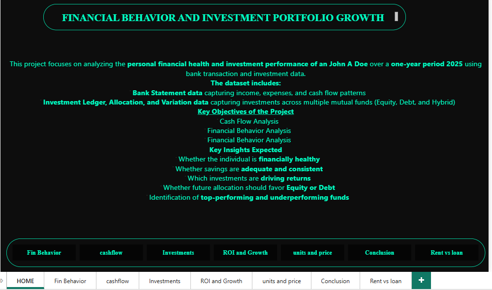

Investment-Portfolio-Dashboard

This project analyzes long-term portfolio investment growth with a focus on SIP contributions and portfolio performance across equity, debt, and hybrid instruments. The dashboard helps understand growth trends, allocation patterns, and return distribution to support better investment decisions.

Key Insights
  SIP-based investments show steady long-term growth despite short-term volatility
  Equity instruments contribute higher returns with higher risk exposure
  Portfolio diversification across asset classes improves risk balance
  Fund-wise analysis highlights variation in growth patterns over time

  
Dashboard Features
  Portfolio value vs total investment comparison
  SIP growth trend analysis
  Asset class allocation breakdown
  Fund-wise performance overview
  Interactive filters for time period and category

